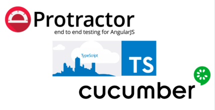

# Web Postman & API  

This project contains the test scripts to validate a web projecto.

E2E automation with **TypeScript**, **ProtractorJS**, **Specs (Unit Test)** and **Cucumber (BDD)**.




- [Structure](#structure)
- [Integration](#integration)
- [Setup](#setup)
- [Execution](#execution)
  - [Spec](#spec)
  - [Features (cucumber)](#features-cucumber)
- [Devopment](#devopment)
  - [VSCode](#vscode)
  - [Git](#git)

## Structure


| folder     | description                                                   |
| :--------- | :------------------------------------------------------------ |
| config     | scripts to control the behavior of the framework              |
| data       | data used during the execution (e.g.: test, environment, app) |
| docs       | framework documentation                                       |
| feature    | features files used in bdd test                               |
| steps      | steps used in the feature files                               |
| pages      | page obects files                                             |
| components | components objects used in page objects                       |
| postman    | postman scripts (collection, environment)                     |
| specs      | specs files used in unit test                                 |
| support    | enable integration with Jira Xray                             |


## Integration


## Setup

Envorionment variables used:

| variable   |  type   | description                                            |
| :--------- | :-----: | :----------------------------------------------------- |
| CI         | boolean | identifies if you are running the CI process           |
| DIRECT     | boolean | identifies whether it connects directly to the driver  |
| GRID       | string  | selenium grid address                                  |
| BROWSER    | string  | browsers to be used                                    |
| APP_ENV    | string  | identify the runtime environment                       |
| TAG        | string  | identifies the scenarios to run                        |
| RESOLUTION | string  | define the browser resolution: mobile, tablet, desktop |
| USER_ID    | number  | index used to select the default user                  |
| XRAY       | boolean | enable integration with Jira Xray                      |

Examples:

- Local

```
CI=false
DIRECT=true
GRID=
BROWSER=chrome
APP_ENV=int2
TAG=
RESOLUTION=desktop
USER_ID=0
XRAY=false
```

## Execution


### Spec

Execution:

```shell
npm run spec
```

Report (allure):

```shell
npm run report
```

### Features (cucumber)

```shell
npm run bdd
```

Report (allure):

```shell
npm run report
```

Report HTML:

Open the file `reports/report/index.html`.

## Devopment

Patterns and concepts used:

- [Page Object](https://martinfowler.com/bliki/PageObject.html)
- [SOLID](https://en.wikipedia.org/wiki/SOLID)
- [Kiss](https://en.wikipedia.org/wiki/KISS_principle)
- [Low Cyclomatic complexity](https://en.wikipedia.org/wiki/Cyclomatic_complexity)

### VSCode

Setup the vscode extensions used in the project:

- PowerShell

```powershell
cat .vscode\extensions.list |% { code --install-extension $_}
```

- Shell

```shell
cat .vscode/extensions.list | xargs -L 1 code --install-extension
```

### Git

Semantic Commit Messages

See how a minor change to your commit message style can make you a better programmer.

Format: `<type>(<scope>): <subject>`

<scope> is optional

Example:

```
feat: add hat wobble
^--^  ^------------^
|     |
|     +-> Summary in present tense.
|
+-------> Type: chore, docs, feat, fix, refactor, style, or test.
```

More Examples:

- feat: (new feature for the user, not a new feature for build script)
- fix: (bug fix for the user, not a fix to a build script)
- docs: (changes to the documentation)
- style: (formatting, missing semi colons, etc; no production code change)
- refactor: (refactoring production code, eg. renaming a variable)
- test: (adding missing tests, refactoring tests; no production code change)
- chore: (updating grunt tasks etc; no production code change)
